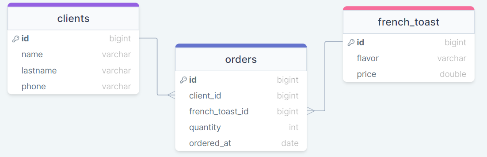

# 🎅‍Sobre o projeto🎄

Esse projeto foi feito com o intuito de exercitar minhas habilidades com Java e Spring.
"Kasa da Lu" é uma loja fictícia que vende rabanadas no natal. Através dessa API, é possível cadastrar clientes e 
ordenar pedidos!

## 💿Como rodar na sua máquina

### Pré-requisitos

- **Git**;
- **Docker + Docker-Compose (caso queira utilizar Docker)**;
- **Java 17 + Maven (caso queira utilizar o Maven)**

<details>
    <summary><b style="font-size:1.4em;">🐳Utilizando Docker</b></summary>

```shell
# Clone o repositório na sua máquina
$ git clone https://github.com/lleonardus/kasa-da-lu.git

# Abra a pasta do projeto
$ cd kasa-da-lu

# Inicie o projeto usando Docker
$ docker-compose up
```

Após esse processo, a API vai estar rodando em **http://localhost:8080** 
e a documentação estará disponível em **http://localhost:8080/swagger-ui.html**.

</details>

<details>
    <summary><b style="font-size:1.4em;">♨️Utilizando Maven</b></summary>

```shell
# Clone o repositório na sua máquina
$ git clone https://github.com/lleonardus/kasa-da-lu.git

# Abra a pasta do projeto
$ cd kasa-da-lu

# Inicie o projeto usando Maven
$ mvn spring-boot:run
```

Após esse processo, a API vai estar rodando em **http://localhost:8080**,
a documentação estará disponível em **http://localhost:8080/swagger-ui.html**
e o banco de dados (H2 database) poderá ser acessado em **http://localhost:8080/h2-console/**

</details>

Obs: Caso não queira utilizar nenhumas das opções acima, ainda é possível rodar o projeto utilizando
uma IDE da sua preferência (Intellij, Eclipse...)

## 💾Banco de Dados



Dentro de `src/main/resources` coloquei um arquivo chamado **data.sql** que já contém alguns dados
para testar a API. Caso queira fazer alguma alteração nesses dados, basta alterar o arquivo manualmente.

## 🎯Endpoints

### 👨‍👩‍👧‍👦Clients

- **GET** `/kasa-da-lu/clients`: Retorna uma lista com todos os clientes.
- **GET** `/kasa-da-lu/clients/{id}`: Retorna um cliente em específico.
- **POST** `/kasa-da-lu/clients`: Registra um novo cliente.
- **POST** `/kasa-da-lu/clients/{id}/buy?flavor={flavor}&quantity={quantity}`: Ordena o pedido de uma rabanada.
O parâmetro flavor permite os sabores **chocolate, doce de leite, tradicional e nutella**. O parâmetro quantity deve ser um inteiro maior que zero.
- **PUT** `/kasa-da-lu/clients/{id}`: Atualiza um cliente em específico.

### 🍞French Toast

- **GET** `/kasa-da-lu/toasts`: Retorna uma lista com todas as rabanadas disponíveis no cardápio.

### 📜Orders

- **GET** `/kasa-da-lu/orders`: Retorna uma lista com todos os pedidos.

## 🧰Ferramentas Utilizadas

- Java 17
- Spring Boot
- Spring Web
- Spring Data JPA
- H2 Database
- SpringDoc OpenAPI
- Lombok
- Model Mapper